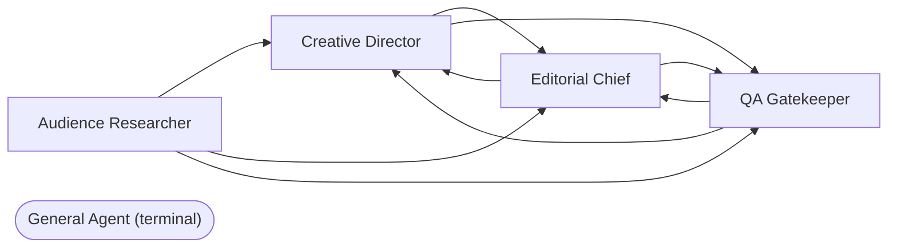

# Plan — Make AGENTS.md handoff targets explicit + Mermaid graph (#946)

**Spec:** [../SPEC.md](../SPEC.md)
**Issue:** [#946](https://github.com/oviney/blog/issues/946)
**Date:** 2026-05-24
**Label:** `agent:qa-gatekeeper`
**Branch:** `docs/946-agents-handoff-graph` (to be created)
**Lifecycle phase:** PLAN

---

## Scope summary

Single-file docs change to `AGENTS.md` (lines 44–122 region). ~25 line insertions total. No code, no governance surface, no protected files. Two atomic commits split by concern: structured per-persona data first, cross-cutting visualisation second.

---

## Dependency graph

```
Phase 1 (rows) ──► Checkpoint A ──► Phase 2 (graph) ──► Checkpoint B ──► Phase 3 (ship)
```

Phase 1 and Phase 2 touch different regions of `AGENTS.md` so they're file-level independent, but conceptually ordered: rows establish the canonical per-persona target sets; the Mermaid graph visualises those same sets and must agree with them. Building rows first lets Checkpoint A lock the topology before Phase 2 commits it visually.

---

## Vertical slices

### Phase 1 — Per-persona handoff rows
*One atomic commit. Each row is a complete unit of value (a single persona becomes machine-readable).*

| Task | Target | Insertion | New row |
|---|---|---|---|
| 1.1 | `AGENTS.md` Creative Director table (line ~52, after `**Must not touch**`) | New row | `\| **Valid handoff targets** \| [Editorial Chief](#3-editorial-chief), [QA Gatekeeper](#2-qa-gatekeeper) \|` |
| 1.2 | `AGENTS.md` QA Gatekeeper table (line ~68) | New row | `\| **Valid handoff targets** \| [Creative Director](#1-creative-director), [Editorial Chief](#3-editorial-chief) \|` |
| 1.3 | `AGENTS.md` Editorial Chief table (line ~84) | New row | `\| **Valid handoff targets** \| [Creative Director](#1-creative-director), [QA Gatekeeper](#2-qa-gatekeeper) \|` |
| 1.4 | `AGENTS.md` Audience Researcher table (line ~100) | New row | `\| **Valid handoff targets** \| [Creative Director](#1-creative-director), [Editorial Chief](#3-editorial-chief), [QA Gatekeeper](#2-qa-gatekeeper) \|` |
| 1.5 | `AGENTS.md` General Agent table (line ~116) | New row | `\| **Valid handoff targets** \| _(terminal — handles work end-to-end)_ \|` |

**Phase 1 ACs covered:** AC-1, AC-2, AC-5, AC-8 (prose untouched), AC-6 (build).

**Phase 1 verification:**
```bash
grep -c "Valid handoff targets" AGENTS.md         # expect 5
grep -c "_(terminal — handles work end-to-end)_" AGENTS.md  # expect 1
bundle exec jekyll build                          # exit 0
```

**Commit:** `docs(#946): add Valid handoff targets row to each persona`

---

### Checkpoint A — Topology lock

Before starting Phase 2, cross-check every edge in the Phase 1 rows against the existing `**Handoff triggers**:` prose:

| From | To | Existing prose line |
|---|---|---|
| Creative Director | Editorial Chief | line 56 |
| Creative Director | QA Gatekeeper | line 56 |
| QA Gatekeeper | Creative Director | line 72 |
| QA Gatekeeper | Editorial Chief | line 72 |
| Editorial Chief | Creative Director | line 88 |
| Editorial Chief | QA Gatekeeper | line 88 |
| Audience Researcher | Creative Director | line 104 |
| Audience Researcher | Editorial Chief | line 104 |
| Audience Researcher | QA Gatekeeper | line 104 |
| General Agent | — (terminal) | n/a (no prose) |

**Pass criteria:** every edge in Phase 1's rows has a matching prose sentence; every prose sentence is reflected as an edge. Mismatch → halt and reconcile before Phase 2.

---

### Phase 2 — `## Handoff Graph` section
*One atomic commit. Pure additive — new top-level section.*

| Task | Action |
|---|---|
| 2.1 | Insert new `## Handoff Graph` section immediately before `## Protected Files (all agents)` (currently at line 122) |
| 2.2 | Brief intro paragraph (1–2 sentences) explaining the diagram source-of-truth status |
| 2.3 | Mermaid code fence (` ```mermaid `) with `graph LR` content encoding exactly the 9 edges from Checkpoint A plus the terminal General Agent node |

**Mermaid content (final):**

````markdown

````

**Phase 2 ACs covered:** AC-3, AC-4, AC-6 (build), AC-7 (render).

**Phase 2 verification:**
```bash
grep -c "## Handoff Graph" AGENTS.md              # expect 1
grep -c "^graph LR" AGENTS.md                     # expect 1
grep -cE "(CD|QA|EC|AR|GA)" AGENTS.md             # ≥ 10 (5 declarations + edges)
bundle exec jekyll build                          # exit 0
```

**Visual verification (AC-7):**
```bash
bundle exec jekyll serve --config _config.yml,_config_dev.yml &
# Open http://localhost:4000/ — confirm the site still builds and Mermaid renders if AGENTS.md is exposed as a page.
# If AGENTS.md is not rendered as a Jekyll page, fall back to GitHub PR diff preview (Mermaid renders natively on github.com).
```

**Commit:** `docs(#946): add Handoff Graph section with Mermaid diagram`

---

### Checkpoint B — Pre-PR final check

Run the full AC battery one more time:

| AC | Check |
|----|---|
| AC-1 | `grep -E '^\| \*\*Valid handoff targets\*\*' AGENTS.md \| wc -l` → 5 |
| AC-2 | `grep -c "Valid handoff targets" AGENTS.md` → 5 |
| AC-3 | `grep -c "## Handoff Graph" AGENTS.md` → 1 |
| AC-4 | Mermaid edge count: `awk '/^&#96;&#96;&#96;mermaid/{f=1;next} /^&#96;&#96;&#96;$/{f=0} f' AGENTS.md \| grep -c -- '-->'` → 9; terminal node: `grep -c 'GA(\["General Agent (terminal)"\])' AGENTS.md` → 1. Beware the naïve `awk '/^## Handoff Graph/,/^## /'` form — the range terminates on the opening header line and returns 0. |
| AC-5 | `grep "_(terminal" AGENTS.md` → present on General Agent |
| AC-6 | `bundle exec jekyll build` → exit 0 |
| AC-7 | Local dev preview OR GitHub PR diff renders Mermaid |
| AC-8 | `grep -c "^\*\*Handoff triggers\*\*:" AGENTS.md` → 4 (strict; line-starting prose paragraphs only — the section intro mentions the phrase as inline code, which a naïve `grep -c "Handoff triggers"` would over-count to 5) |

**Pass criteria:** all 8 ACs green.

---

### Phase 3 — Ship
*Standard `/ship` flow per `.github/skills/git-operations/SKILL.md`.*

| Task | Action |
|---|---|
| 3.1 | Push branch `docs/946-agents-handoff-graph` |
| 3.2 | Open PR with `Closes #946` |
| 3.3 | No labels needed (`AGENTS.md` is not in `.github/skills/` or `.github/instructions/`, so no `governance-update` label) |
| 3.4 | Wait for CI green (or admin-merge if blocked by phantom `build` check + 1-reviewer rule, matching #953 precedent) |
| 3.5 | Merge `--squash --delete-branch` |
| 3.6 | Post-merge: confirm Deploy Jekyll site to Pages + Production Smoke Tests pass on the merge commit |
| 3.7 | Comment on #946 with production verification notes |

---

## Risks (from SPEC §11, re-evaluated)

| Risk | Realised? | Plan response |
|---|---|---|
| Mermaid plugin not loaded → diagram doesn't render in Jekyll output | Unknown until Phase 2 build | If `jekyll build` warns or the rendered HTML shows the raw code fence, fall back to a Markdown table representation; amend AC-3/AC-4 in SPEC.md to match |
| Table format varies across personas | No — confirmed uniform `\| Property \| Value \|` in §1.5 (read 2026-05-24) | None needed |
| Reviewer wants `graph TD` not `graph LR` | Unknown | Trivial swap; address in review |
| Phantom `build` required check + 1-reviewer block | Yes — recurring | Admin-merge as maintainer (per #953 precedent and user memory) |

---

## Out of scope (locked, per SPEC §12)

- Persona roster changes
- Modifying `**Handoff triggers**:` prose
- Touching `.github/skills/`, `.github/instructions/`, `.github/copilot-instructions.md`
- Cross-repo A2A integration
- A CI lint that compares the graph against the prose (sensible follow-up, not this PR)
